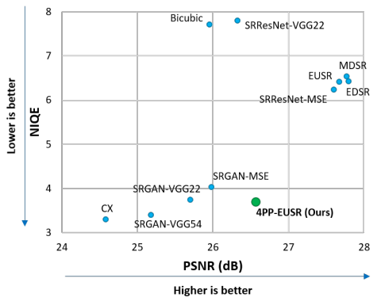

# 4PP-EUSR
Four-pass perceptual super-resolution with enhanced upscaling


## Introduction
This repository contains a TensorFlow-based implementation of **[4PP-EUSR ("Deep learning-based image super-resolution considering quantitative and perceptual quality")](http://arxiv.org/abs/1809.04789)**, which considers both the quantitative (e.g., PSNR) and perceptual quality (e.g., NIQE) of the upscaled images.
Our method **won the 2nd place and got the highest human opinion score for Region 2** in the [2018 PIRM Challenge on Perceptual Image Super-resolution at ECCV 2018](https://arxiv.org/abs/1809.07517).


※ The perceptual index is calculated by "0.5 * ((10 - [Ma](https://sites.google.com/site/chaoma99/sr-metric)) + [NIQE](https://doi.org/10.1109/LSP.2012.2227726))", which is used in the [PIRM Challenge](https://www.pirm2018.org/PIRM-SR.html). Lower is better.

Followings are the performance comparison evaluated on the [BSD100](https://www2.eecs.berkeley.edu/Research/Projects/CS/vision/bsds/) dataset.



Method | PSNR (dB) (↓) | Perceptual Index
------------ | :---: | :---:
[EDSR](https://github.com/thstkdgus35/EDSR-PyTorch) | 27.796 | 5.326
[MDSR](https://github.com/thstkdgus35/EDSR-PyTorch) | 27.771 | 5.424
[EUSR](https://github.com/ghgh3269/EUSR-Tensorflow) | 27.674 | 5.307
[SRResNet-MSE](https://arxiv.org/abs/1609.04802) | 27.601 | 5.217
**4PP-EUSR (PIRM Challenge)** | **26.569** | **2.683**
[SRResNet-VGG22](https://arxiv.org/abs/1609.04802) | 26.322 | 5.183
[SRGAN-MSE](https://arxiv.org/abs/1609.04802) | 25.981 | 2.802
Bicubic interpolation | 25.957 | 6.995
[SRGAN-VGG22](https://arxiv.org/abs/1609.04802) | 25.697 | 2.631
[SRGAN-VGG54](https://arxiv.org/abs/1609.04802) | 25.176 | 2.351
[CX](https://arxiv.org/abs/1803.04626) | 24.581 | 2.250

Please cite following papers when you use the code, pre-trained models, or results:
- J.-H. Choi, J.-H. Kim, M. Cheon, J.-S. Lee: **Deep learning-based image super-resolution considering quantitative and perceptual quality**. arXiv:1809.04789 (2018) [[arXiv]](http://arxiv.org/abs/1809.04789)
```
@article{choi2018deep,
  title={Deep learning-based image super-resolution considering quantitative and perceptual quality},
  author={Choi, Jun-Ho and Kim, Jun-Hyuk and Cheon, Manri and Lee, Jong-Seok},
  journal={arXiv preprint arXiv:1809.04789},
  year={2018}
}
```
- J.-H. Kim, J.-S. Lee: **Deep residual network with enhanced upscaling module for super-resolution**. In: Proceedings of the IEEE Conference on Computer Vision and Pattern Recognition (CVPR) Workshops, pp. 913-921 (2018) [[Paper]](http://openaccess.thecvf.com/content_cvpr_2018_workshops/w13/html/Kim_Deep_Residual_Network_CVPR_2018_paper.html)
```
@inproceedings{kim2018deep,
  title={Deep residual network with enhanced upscaling module for super-resolution},
  author={Kim, Jun-Hyuk and Lee, Jong-Seok},
  booktitle={Proceedings of the IEEE Conference on Computer Vision and Pattern Recognition (CVPR) Workshops},
  year={2018}
}
```

## Dependencies
- Python 3.6+
- TensorFlow 1.8+

## Test pre-trained models
Generating upscaled images from the trained models can be done by `test/test.py`.
Following are the brief instructions.

1. Download and copy the trained model available in [Downloads](#downloads) section to the `test/` folder.
2. Place the low-resolution images (PNG only) to the `test/LR/` folder.
3. Run `python test.py --model_name [model file name]`. For example, if you downloaded the PIRM Challenge version of our pre-trained model, run `python test.py --model_name 4pp_eusr_pirm.pb`.
4. The upscaled images will be available on the `test/SR/` folder.

Please run `python test.py --help` for more information.

## Training 4PP-EUSR
Implementing the training code is in progress.
Please refer to [README.md on the `train/` folder](train/) for more information.

## Downloads
Pre-trained models:
- PIRM Challenge version: [4pp_eusr_pirm.pb](http://mcml.yonsei.ac.kr/files/4pp_eusr/4pp_eusr_pirm.pb)
- Paper version: [4pp_eusr_paper.pb](http://mcml.yonsei.ac.kr/files/4pp_eusr/4pp_eusr_paper.pb)

Results (Set5, Set14, BSD100, PIRM):
- PIRM Challenge version: [4pp_eusr_results_pirm.zip](http://mcml.yonsei.ac.kr/files/4pp_eusr/4pp_eusr_results_pirm.zip)
- Paper version: [4pp_eusr_results_paper.zip](http://mcml.yonsei.ac.kr/files/4pp_eusr/4pp_eusr_results_paper.zip)
